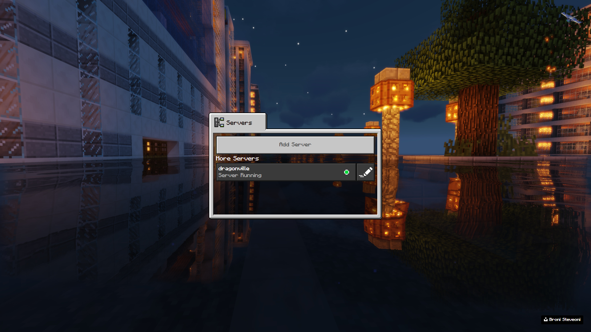
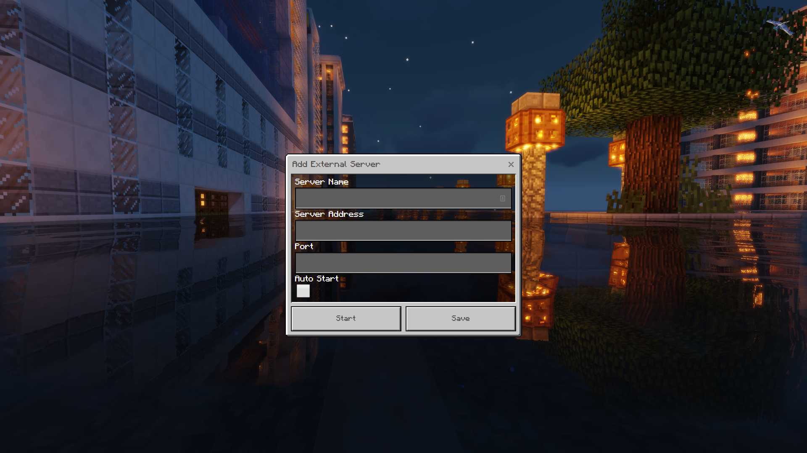

# Phantom Web

Phantom Web is a Node.js based web wrapper for [phantom](//github.com/jhead/phantom) by [jhead](//github.com/jhead). Phantom is a server repeater project that allows console players on Xbox and Playstation (note: as per jhead there is no support for Switch at time of publishing) to access custom Bedrock servers (also known as PE on some platforms). Phantom Web was built to a specific spec that allows deployment of Raspberry Pi's as configure once deploy anywhere server repeaters, great if you're hosting servers for friends and especially helpful if you have a mix of platforms and want an easy solution. What follows are instructions that will allow you to meet this spec using this project. The web UI also allows for relatively easy editing and configuration of additional servers by the end user should it become desirable.

#### Familiar UI


##### Intuitive controls just click to start/stop servers.

<div>
  
  
</div>

## Getting Started

These instructions will get you a copy of the project up and running on a Raspberry Pi. If you're deploying on a Linux PC you can skip to the downloading the project stage.

### Prerequisites

1. A PC or Arm based device running Linux.

    - For testing I utilised the Windows Subsystem for Linux (WSL) during developement running Ubuntu 18.04 and for deployment a Raspberry Pi 3 running Ubuntu 19.10.1, so consider these platforms validated, although as all of the commands used are native Linux commands they should run on all platforms where Node.js is supported.
   
    - RE - Windows and Mac support. I did not have time to add support for these platforms and test that they were stable. You're welcome to submit a pull request, the simplest solution is some extra if statements in the update function, a switch from renaming the executable to a variable that holds the name of the executable in use, and then inserting that name into the format strings already in use in the start/stop functions. I will add support in future as I am able.
   
2. A MicroSD card if you're using a Raspberry Pi or a USB drive and sufficient unused hard drive space if you're using a PC.

    - I would recommend at least 8GB of storage for the Pi (I used a 32GB Samsung Evo Plus MicroSD Card) and at least 16GB for a PC just to be comfortable.
  
    - For the Pi, unless you already have a Linux PC around, you will still need a thumb drive with a bootable USB of Ubuntu and the ability to select it as a temporary boot device on a PC. This sucks but there's no way around it in order to enable SSH until Windows allows the WSL Linux Kernals to directly access RAW storage devices so we can access Linux paritions within Windows.
  
3. Your chosen Linux image for Raspberry Pi, and/or PC.

    - I would recommend [Ubuntu Server](https://ubuntu.com/download/raspberry-pi) for this task, select 64bit if you're on a Pi 3 or 4, but you could skip the SSH configuration step and plug in a monitor and peripherals into the Pi if you prefer, skip steps B-F in section 1 of the install instructions if you take this route.
  
    - I'll be assuming from here on that we're installing Ubuntu Server on a Raspberry Pi.
  
4. Balls of a steal and a desire for adventure. It's time to install.

### Installing

1. Install Ubuntu Server on the MicroSD card.
    
    A. Follow the instructions provided by Canonical [here](https://ubuntu.com/download/iot/installation-media).
    
    B. Flash a USB with a Ubuntu ISO and utilise your PC boot device selection menu to do a once off selection, there are plenty of guides online.
    
    C. Open the file manager and find your MicroSD card in the side pane, it will show up as two paritions we want the one labeled `boot`.
    
    D. Right-click in an empty area of the file view and select `Open in Terminal`.
    
    E. Don't be scare this next bit is really easy, type or copy over the following (hint right click to paste into terminal as Ctrl+V does something else inside the terminal window) `touch ssh`. All this does is create an empty file called ssh that enables remote access to the Pi over the local network.
    
    F. That's it. We're done. Now you can shutdown your PC that's running the bootable Linux USB and return to Windows.
    
    G. Insert the MicroSD card into the Pi and plug it into the network and power. In addition now is the time to plugin your Keyboard and Monitor if you're just rejoining us after skipping the SSH config.
    
2. Remote into the PI and configure it.

    A. Time to SSH in.
        
      - Default user is ubuntu and the default password is also ubuntu, you'll be prompted to change the passowrd when you first login.
        
      - You will need to know the IP address of your Pi. There are various tools to find it but it's usually easier to check your routers DHCP leases.
        
      - You can use a tool like Putty to SSH in.
        
      - Cygwin is also an option to install a full Linux compatible developement environment that includes SSH.
        
      - Or you could install WSL, probably the easiest option although it does require Windows 10 Pro.
        
      - If this is all sounding to hard, feel free to plugin a keyboard and monitory.
    
    B. Let's start by updating all of the software packages. This updates literally everything, removes defunct packages and reboots the Pi.
        
      - `&&` means run the next command after the previous one has completed, in case you're wondering.
        
      - You will need to reconnect once this finishes executing.
        
    ```bash
    sudo apt-get update && sudo apt-get upgrade && sudo apt-get dist-upgrade && sudo apt-get autoremove && sudo reboot
    ```
    
    C. Next let's install Node.js. 
        
      - I'll save you some time Googling for this one, they make it way to complicated to find this information...
        
      - We'll also install the Build Essentials toolkit and git while we're here.
        
    ```bash
    curl -sL https://deb.nodesource.com/setup_13.x | sudo -E bash - && sudo apt-get install -y nodejs build-essential git
    ```

3. Now we can clone phantom-web and configure it.

    A. Clone/copy/download the project.
  
    ```bash
    git clone https://github.com/azariah001/phantom-web.git ./phantom-web/
    ```
  
    B. Then move into the directory using the `cd` command. Type `cd phantom-web` then enter.
  
    C. Now we need to install all of our dependancies. Simply run `npm install` and wait.
  
    D. If you'd like to confirm at this point that everything we've done to this point is working you can try running `phantom-web` by entering `node app.js`.
  
      - If it's working you'll see a text prompt after 10 seconds notifying you that phantom has been updated to the latest version.
    
      - You can also confirm the UI is working by going to the IP address of your server followed by `:3000` in a web browser. Eg. `192.168.0.101:3000`.
    
      - Alternatively if you're running a GUI on your Pi you can go to `localhost:3000`.
    
4. Time to configure phantom-web for "production".

    A. First we need to check that the phantom-web.service file is configured correctly for your installation.
  
      1. Please confirm that the file paths that include `/home/ubuntu/phantom-web` match where you've located your phantom-web install directory, example included below.
    
      2. If not now is the time to edit them, `nano phantom-web.service`.
        
      3. Ctrl+O to save changes. Ctrl-X to exit.
    
    ```bash
    [Unit]
    Description=Phantom Web

    [Service]
    ExecStart=/home/ubuntu/phantom-web/app.js
    Restart=always
    Environment=PATH=/usr/bin:/usr/local/bin
    Environment=NODE_ENV=production
    WorkingDirectory=/home/ubuntu/phantom-web

    [Install]
    WantedBy=multi-user.target
    ```
  
  B. Now we can copy the phantom-web.service file to it's install directory.

  - Note if you're using a non SystemD distro you've got some extra work to do here to get your distro's init system working.

  ```bash
  cp phantom-web.service /etc/systemd/system
  ```
  
  C. Now we can run it for the service for the first time.
  
  ```bash
  systemctl start phantom-web
  ```
  
  D. If it starts succesfully you can now enable the service.
  
  - This will ensure it starts everytime the Pi boots up and if for some reason phantom-web crashes this will automatically restart it.
   
  ```bash
  systemctl enable phantom-web
  ```
  
  E. (optional) Forward port 80 to port 3000 so you only have to type the IP to access the UI.
  
  - This is the lazy mans way of doing this OK? If you were doing this porperly and wanting to secure everything properly you'd use Nginx, but this is supposed to be a beginners guide so here's the quick option.
  
  1. First we need a tool that dosn't come preinstalled in the Pi versions of Ubuntu.
  
  ```bash
  sudo apt-get install net-tools
  ```
  
  2. Run `ifconfig` and make note of your lan interface. For most users it should be `eth0` but can be a much longer label depending on which version of the network stack your distribution is using.
  
  3. Run the following command to forward incoming request from port 80 to 3000 and visa versa.
  
  - Change `eth0` if you need to.
  
  ```bash
  sudo iptables -t nat -A PREROUTING -i eth0 -p tcp --dport 80 -j REDIRECT --to-port 3000
  ```
  
  4. Then install the following package to make your iptables rules persistent.
  
  - The install should prompt you to enter yes to save current configuration to file.
  
  ```bash
  sudo apt-get install iptables-persistent
  ```
  
  5. If you find you need to manually save your iptables config, these are the commands.
  
  ```bash
  sudo netfilter-persistent save
  sudo netfilter-persistent reload
  ```
  
  6. Perfection, now you can just type your IP address into your browser and it will open the UI. `192.168.0.101`

  F. F for finished. You've now configured your Pi to run phantom-web, with auto start on boot, and (optionally) port forwarding for easy access.
  
## Deployment

1. Hand Pi to friend with a short network cable, a USB wall wart, and a micro USB cable.
2. Instruct them in the order of operations to connect it to their router.
3. Enjoy!

4. Until they want to add other servers, in which case.
5. Help them find the IP of the Pi.
6. Get them to type the IP into their web browser.
7. And give them a short walk through on how to add new servers.
8. Enjoy!!

## Built With

* [Node.js](https://nodejs.org/en/)

## Authors

* **Azarel Howard** - *Initial work* - [azariah001](https://github.com/azariah001)


## License

This project is licensed under the MIT License - see the [LICENSE.md](LICENSE.md) file for details

This project utilises [phantom](//github.com/jhead/phantom) for the core functionality as an unmodified library which is also licensed under an MIT License.

## Acknowledgments

*  [jhead](//github.com/jhead) for creating [phantom](//github.com/jhead/phantom)
*  [broni_steveoni](https://unsplash.com/@broni_steveoni/collections) for creating such an amazing backdrop image and publishing it on [Unsplash](//unsplash.com)
